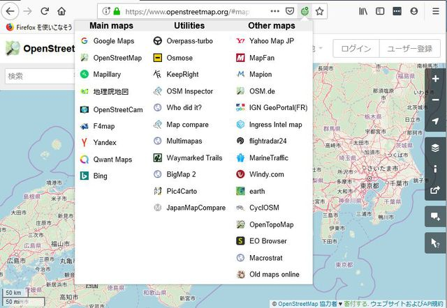
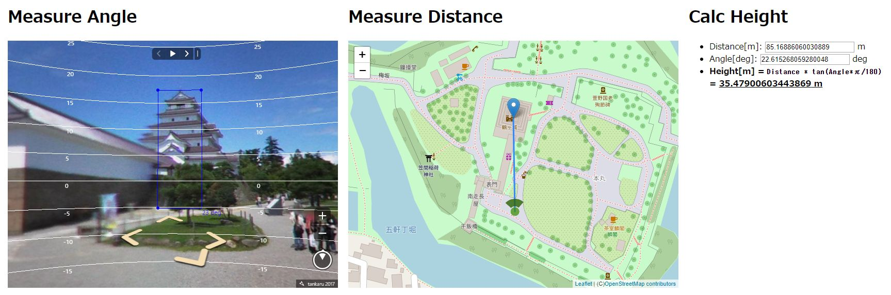
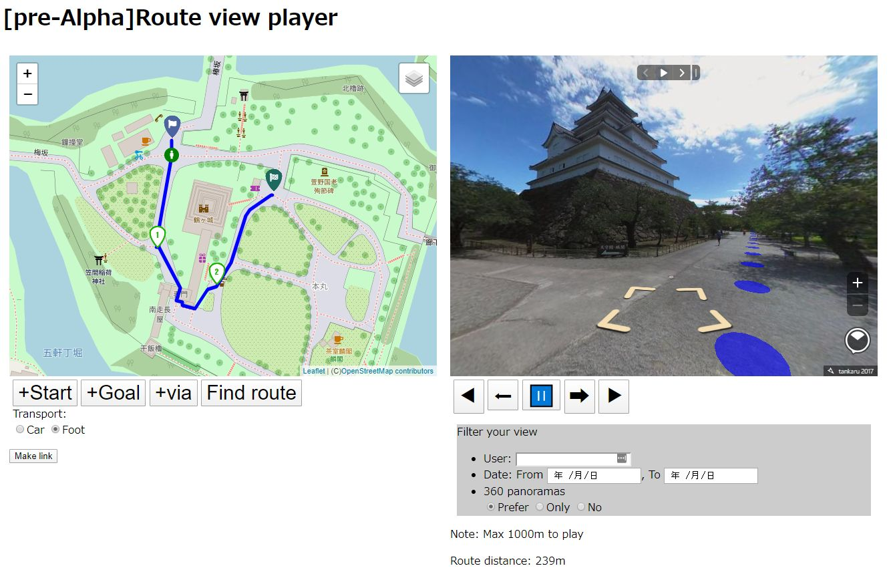
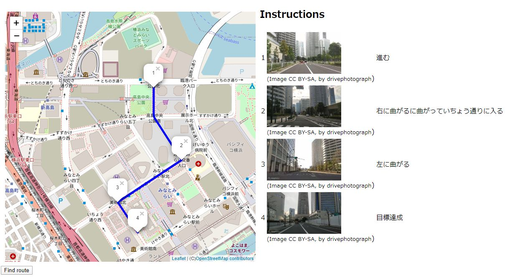
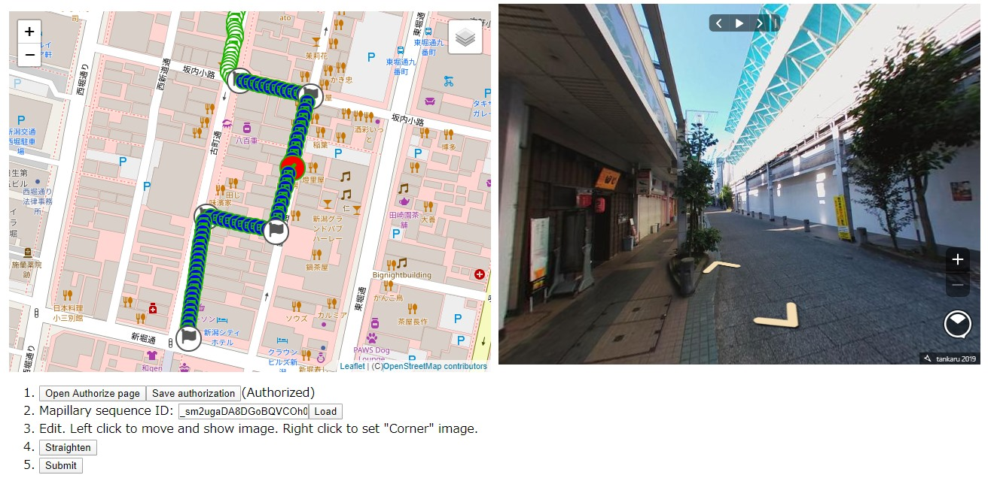
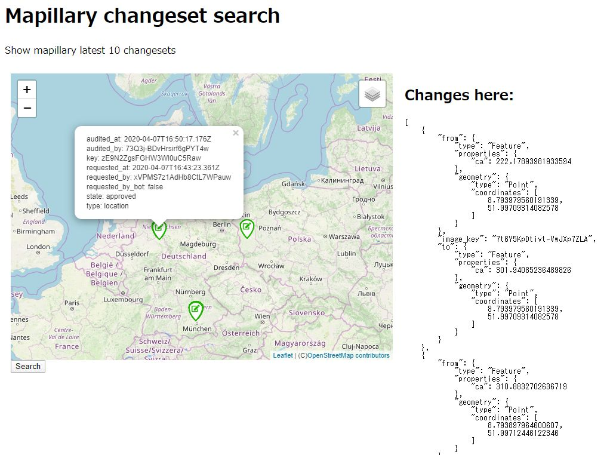
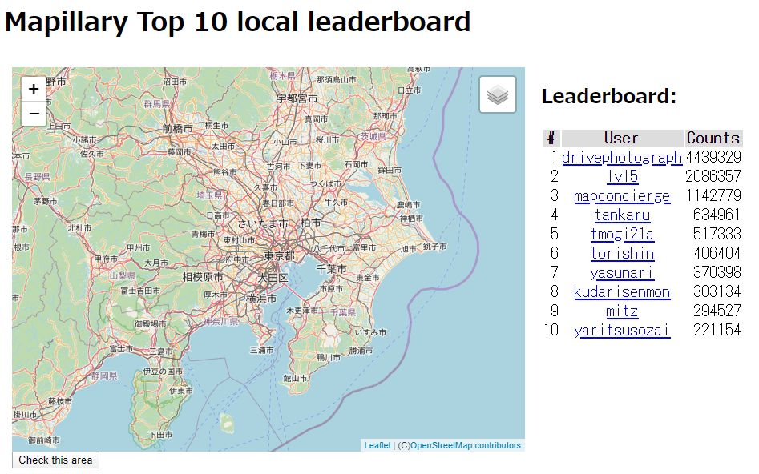

Here's a list of tools I made related to Mapillary.
* OpenSwitchMaps
  * Switch map services like Google maps, OpenStreetMaps, Mapillary and so on. Chrome/Firefox extension.
  * 
* OpenSwitchMaps web
  * Web bookmarklet version of OpenSwitchMaps. More maps supported.
  * 
* Measure height of the object
  * Measure the height of the object using 360 photo.
  * 
* Route view player
  * Find route and auto play mapillary photo along the route.
  * 
* Route finder
  * Find route and display photo at the corner.
  * 
* Sequence straightener
  * Mapillary editor to straighten sequence.
  * 
* Changeset local search
  * Search mapillary changesets in a local area.
  * 
* Local leaderboard
  * Show a leaderboard in a local area.
  * 

Report bug at [Github](https://github.com/tankaru)
